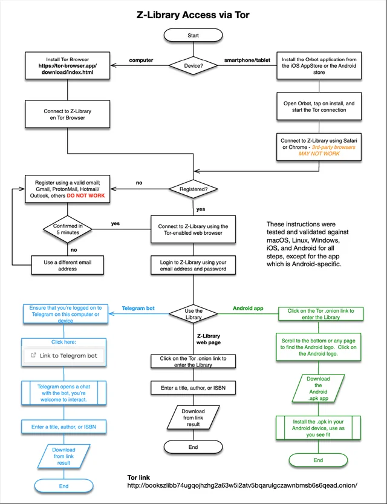
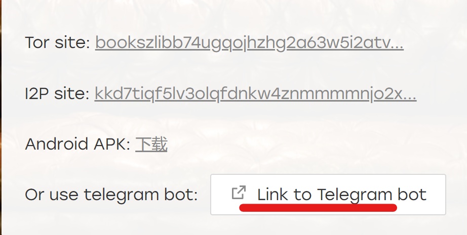

## 说明

- 目前官方有 TGBOT、TOR/I2P、APP 三种渠道，其中 TGBOT 只能下载 50M 以下书籍，其他渠道没有限制。
- 民间，基于之前 Annas-archive 流出来的资源，涌现出一批离线版书库，资源同步到 22 年 10 月，一般需要通过 IPFS 下载。
- 此外，民间还有 zhelper 反编译 APP 得到的搜索/下载接口 zlib.app。此接口和 zlibrary 官方在线库同步，下载也是走 zlibrary 服务器。
- **推荐有能力的尽量走官方网站，其次 zlib.app 在线库，最后用离线库**

### 官方使用教程——一图流 

## 1. TGBOT 官方/需🪜/需注册/限制下载量/最大50M

首先安装 TG：[下载地址](https://telegram.org/)（自备梯子）

然后浏览器打开：https://singlelogin.me/，注册或者登录之后，点击这个按钮就行了（登录之后才能看到）：

50M 以下，每个账号限量 20 本每天。

目前最新地址：[https://t.me/zlib\_basic\_bot](https://t.me/zlib_basic_bot)

## 2. I2P/TOR 官方/需🪜/需注册/限制下载量 

这种方法可以直接访问到原来的官网，就是速度稍微慢一点，然后需要额外下载专用浏览器，进行配置。

### TOR 

浏览器：http://torproject.netcologne.de/zh-CN/download/

网址（必须使用上面的浏览器打开）：http://bookszlibb74ugqojhzhg2a63w5i2atv5bqarulgczawnbmsb6s6qead.onion/

### I2P 

浏览器：https://geti2p.net/en/download

网址（必须使用上面的浏览器打开）：http://kkd7tiqf5lv3olqfdnkw4znmmmmnjo2xqlxrp5ntthp6juowaiha.b32.i2p/

## 3. APP 官方/需🪜/需注册/限制下载量/仅安卓 

**只有安卓可以用，比较稳定，推荐**

[下载地址](https://gofile.io/d/83fK5J)

（如果你打不开这个网站，那么大概率也打不开APP）

打开之后直接登录，然后就像之前用网站一样了。

## 4. zlib.app/ylibrary.org 民间/在线库+离线库 

[zlib.app（在线库）](https://zlib.app/)

>在 z-library 主网站被封之后，z-library 的安卓端 APP 仍能够正常使用。但国内用户，以及非安卓平台用户可能会感到不便。我们分析了 z-library 安卓安装包，得到了可用的 APP 接口，搭建了相应的中转服务，注册了一些公共账号，以方便更多人使用 z-library APP。

[ylibrary.org（离线库）](https://ylibrary.org/)

>这是我们构建的第一个去中心化数据库索引服务。书库中标注为 zlibrary 的一部分来自于 https://annas-archive.org （zlibrary），可以通过 IPFS 等方式获取。书库中标注为 superlib 的一部分来自于网上流传的秒传表（superlib），只能通过秒传形式获取。共计 1500 W 左右数据。请注意二者支持的下载方式并不一致！

## 5. annas-archive/zlib-searcher 民间/开源/离线库 

这两个放一起是因为他们的书源是一致的。

### Annas-archive

这是之前一个 zlib 备份项目，他们把 zlib 整站电子书直接爬了下来，存到了 IPFS 上。zlib 关了之后，他们做了个查询/下载界面，还是比较好用的，而且可以显示封面。如果可以打开，并且不排斥英文的话挺推荐。

网站地址：https://annas-archive.org/

里面的书籍可以通过 IPFS 下载/Libgen 下载（Libgen 是另外一个在线图书馆，和 zlib 有很多重合）。

### zlib-searcher

这是把 Annas-archive 数据库导出之后，另外做了个搜索+界面的开源项目，可以自己部署。

Github 地址：https://github.com/zlib-searcher/zlib-searcher

一个 DEMO：https://zlibsearch.1kbtool.com/

**注意：由于这是一个开源项目，所以有很多人用这个搭建了自己的 zlib-searcher，虽然网址不一样，但是里面的内容完全一致，就不全部放出来了。**

里面的书籍只能通过 IPFS 下载

## 6. clibrary/… 民间

另外的一些民间版本，书不全，用的比较少一点。

[https://clibrary.top/](https://clibrary.top/)

[https://bk.hallowlib.org/](https://bk.hallowlib.org/)

## 7. zhelper TG BOT

**和 4 类似，但是是 TGBOT**

zhelper搜索群: https://t.me/+hYmPpuRHlb83ZTdh

zhelper搜索机器人:https://t.me/zhelper_search_bot